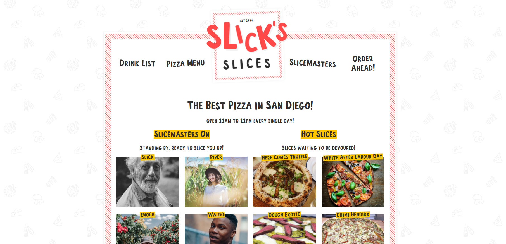
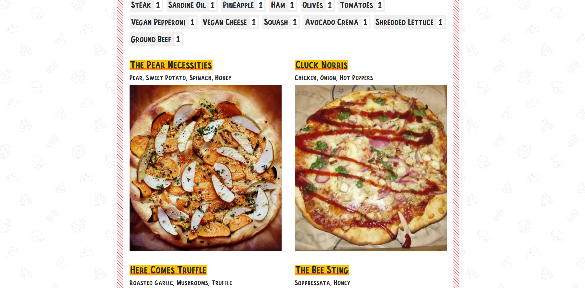

# Master Gatsby

The application is a template that can be used by a restaurant. A full-stack SPA that utilizes webhooks to update data in real-time and serverless functions to process orders. Slick's Slices can be redesigned for any restaurant and can easily be integrated with a POS to accept orders. The application is fully optimized for mobile and includes common SEO features.

## Features

A menu that spans two pages. The drinks are pulled from an API and the pizzas/slicemasters are pulled from Sanity. Users that are currently working can be added or removed using sanity and the home page will change.

## Images

## Getting Started

Check out the current slices available at: [Slick's Slices](https://vibrant-payne-867800.netlify.app/)!

## Technologies Used

* React
* Gatsby
* Sanity
* Netlify (Serverless functions & hosting)
* HTML
* CSS
* JavaScript

## API Used

* [The Cocktail DB](https://rapidapi.com/thecocktaildb/api/the-cocktail-db)

## User Stories

* Users can view current slices and employees.
* Users can view the drinks and pizzas menus.
* Users can calculate and "order".
* Admins can modify the data through a custom portal.
* Users can sort pizzas by ingredients.